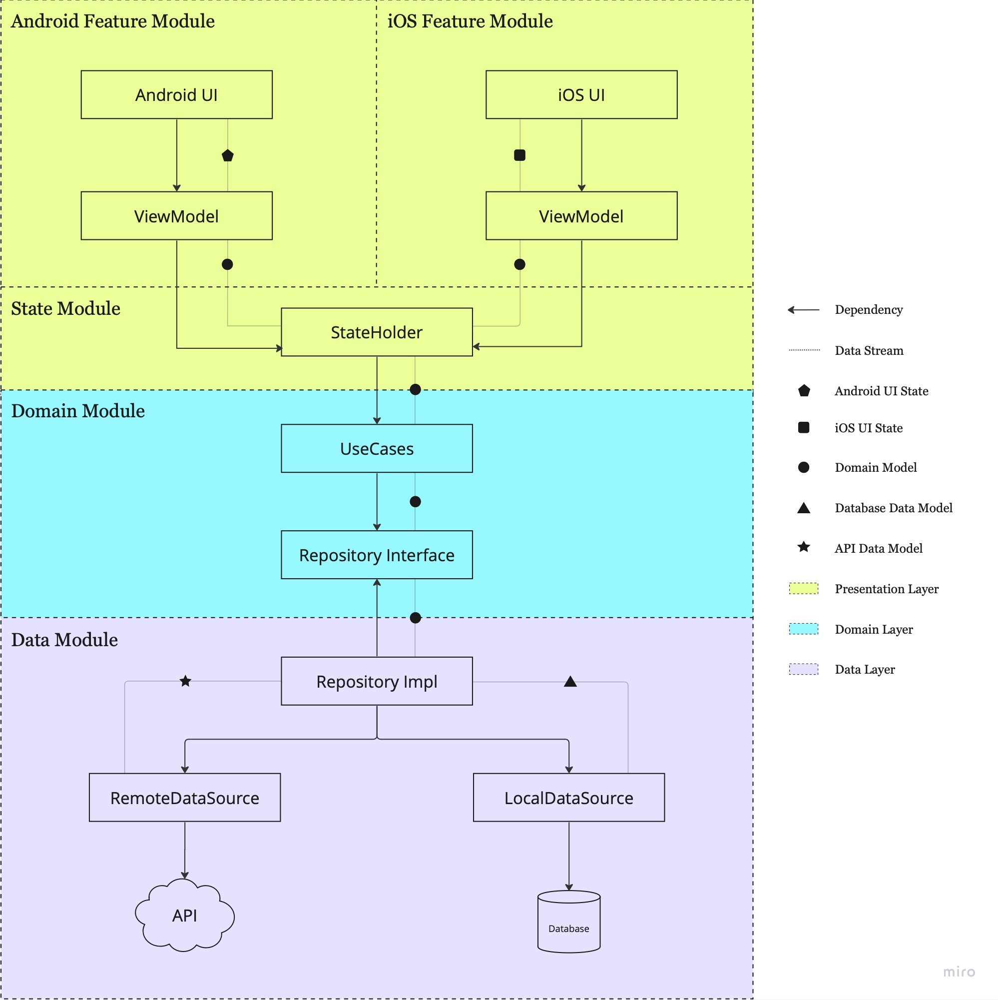

# Monster Compendium - D&D 5th Edition Bestiary

    

Monsters Compendium is an open source Android application contenting information about monsters from the Dungeons & Dragons 5th edition role-playing game. The default content is from the SRD (System's Reference Document), but it is also possible to add new content to the app.

## Previewa

    
    
    

## Tech Stack

- [Jetpack Compose](https://developer.android.com/jetpack/compose): Android’s modern toolkit for building native UI. It simplifies and accelerates UI development on Android.
- [Kotlin Coroutines](https://kotlinlang.org/docs/coroutines-guide.html): A coroutine is a concurrency design pattern that you can use on Android to simplify code that executes asynchronously.
- [Kotlin Flow](): Stream of data that can be computed asynchronously. Built in top of the Kotlin Coroutines.
- [Hilt](https://dagger.dev/hilt): Hilt provides a standard way to incorporate Dagger dependency injection into an Android application.
- [Room](https://developer.android.com/training/data-storage/room): The Room persistence library provides an abstraction layer over SQLite to allow fluent database access while harnessing the full power of SQLite.
- [Retrofit](https://square.github.io/retrofit): A type-safe HTTP client for Android and Java.
- [Accompanist](https://github.com/google/accompanist): A group of libraries that aim to supplement Jetpack Compose with features that are commonly required by developers but not yet available.
- [Coil Compose](https://coil-kt.github.io/coil/compose): An image loading library for Android backed by Kotlin Coroutines and Jetpack Compose.
- [Kotlin Serialization](https://kotlinlang.org/docs/serialization.html): Convert the API JSON responses. 

## App Architecture

The app architecture is divided by feature, domain and data modules. The image below demonstrates it.

### Components Responsibilities

- **UI**: It is responsible to show the data from the UI State to the user.
- **ViewModel**: It is the UI state holder. It transforms the domain model to UI State and holds it, sending to the UI.
- **UseCases**: It holds the business logic. Getting data from the Repository interface or over other use cases.
- **Repository**: It converts the data models (network and database) to domain models.
- **DataSources**: It transfers data from a single source only.

## Adding New Content

You can add custom image and new monsters to the app. The tutorial can be found [here](CONTENT.md).

## API

There is no backend for now. The app retrieves the data from JSON files stored [here](https://github.com/alexandregpereira/hunter-api). The JSON were formatted from the API https://dnd5eapi.co.

## Content License

The content of this app are Open-Gaming License (OGL). The content and license can found at the [D&D 5th Systems Reference Document (SRD)](https://dnd.wizards.com/resources/systems-reference-document). Dungeons & Dragons (D&D) is a trademark of Wizards of the Coast company.

## Icons License

The icons used in this app have a free license. They are designed by [macrovector from Freepik](http://www.freepik.com), [Freepik from Flaticon](https://www.flaticon.com) and [Material Design from Google](https://github.com/google/material-design-icons/blob/master/LICENSE).

## Licence

    Copyright 2022 Alexandre Gomes Pereira
    
    Licensed under the Apache License, Version 2.0 (the "License");
    you may not use this file except in compliance with the License.
    You may obtain a copy of the License at
    
           http://www.apache.org/licenses/LICENSE-2.0
    
    Unless required by applicable law or agreed to in writing, software
    distributed under the License is distributed on an "AS IS" BASIS,
    WITHOUT WARRANTIES OR CONDITIONS OF ANY KIND, either express or implied.
    See the License for the specific language governing permissions and
    limitations under the License.
